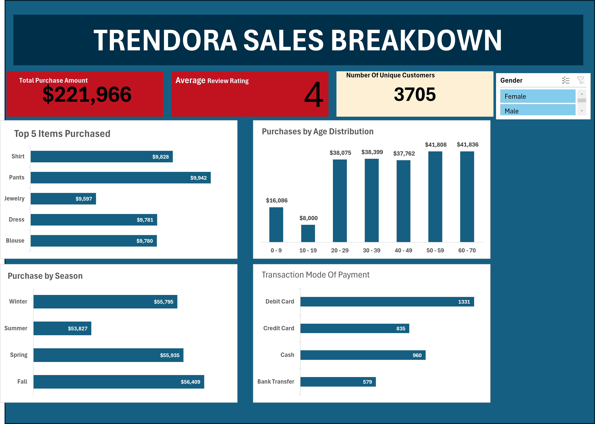

# Trendora Sales Performance Report 
##  Consumer Purchasing Behavior and Performance Analysis of a Growing Fashion Brand using Microsoft Excel

## Executive Summary
- As the business  grows, there has been limited visibility into the rate at which products are being purchased over time.
- Designed an interactive Microsoft Excel dashboard that integrates 3,500+ data points to analyze KPIs, seasonal sales patterns, and customer purchasing behavior across age groups.
- Delivered a centralized and easy-to-interpret Microsoft Excel dashboard that enabled stakeholders to track over $221K in sales. The analysis revealed that Pants and Shirts are the most purchased items, while Dresses and Blouses record equal purchase volumes. It also identified peak purchasing seasons and the most preferred payment methods.

## The Business Problem
### The growing fashion brand requires a data-driven approach to understand how consumer behavior impacts sales across different seasons of the year and to adopt dynamic reporting that provides stakeholders with clear visibility into the overall state of the business.

## Key Questions Addressed:
- The average customer ratings
- The top most items purchased by customers 
- The most preferred method of payment

  ## The Process (Methodology)

###  Tools Used:
 Microsoft Excel and  Pivot Table

 ### Data Sourcing & Overview
The dataset consists of over 3500 sales transactions with 17 columns, covering sales over a period of time.

###  Data Cleaning & Transformation
Using Microsoft Excel, the raw data was transformed to ensure accuracy:
- Removed duplicate entries from the dataset.
- Correction of spelling errors	
- Removed null rolls

## Analysis & Insights
This section breaks down the data into actionable stories.

### Sales Growth & KPI Trends
- Total sales exceeded $221k during the review period.
- Most purchases occur during the fall season, predominantly driven by adults aged 50 and above.

  ### Product Category Performance
-Pants record the highest sales at $9,942, closely followed by dresses with total sales of $9,781.

###  Customer Behavior
- The most purchase is experienced in the fall  and it is closely followed by spring which also enjoy some reasonable purchases.
- By age distribution, the most purchase is done by people of age range 50-59 years.
- Most preferred means of payment is done with a Debit Card.

  ## Recommendations
 Based on the data analysis, I recommend the following action for the growing fashion business,

- The fashion business should increase its investment in Pants, Dresses, and Blouses, as these products generate the highest sales.

- The business should ensure adequate inventory availability, particularly during the Fall and Spring seasons, when customer demand is highest.

- Product offerings should be primarily tailored to adults, as they represent the largest segment of buyers.

- The company should focus on and strengthen the most preferred payment methods to make transactions easier and more convenient for customers, thereby improving overall purchase experience.

